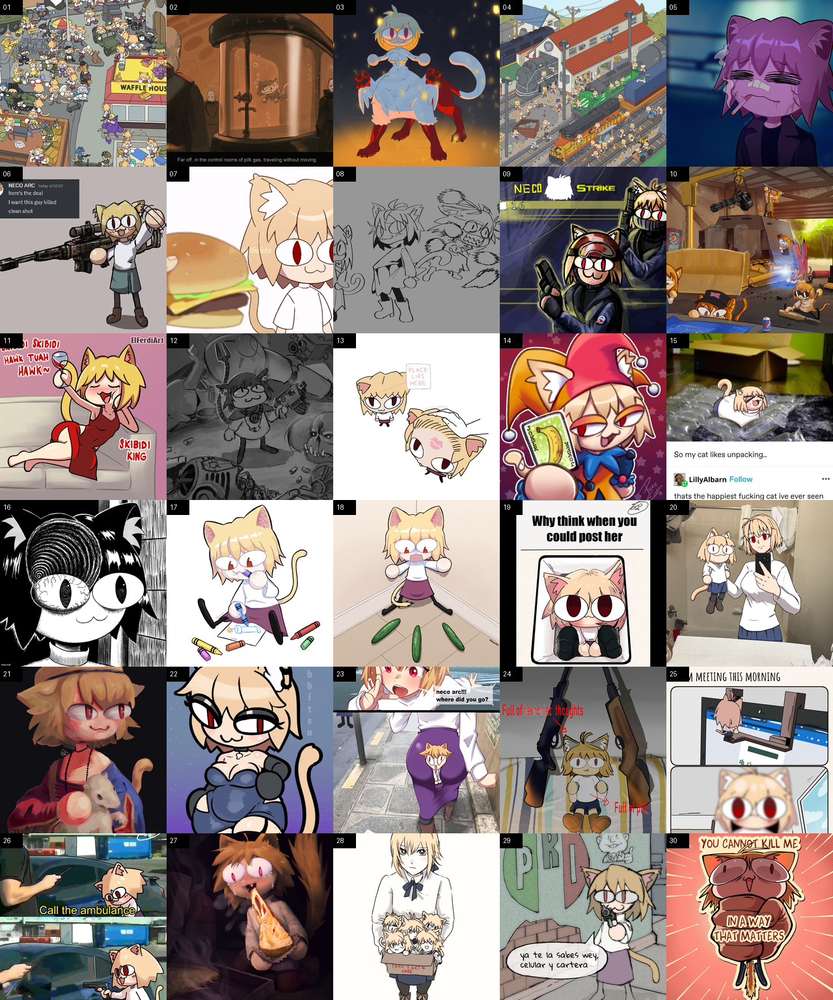

# Neco Arc × Deadlock

### Aru Audio Pack + Neco Arc Hideout Portraits

A client-side **Deadlock** modding project that turns a large part of the game's audio experience into a Neco-Arc / Neco-Chaos themed sound pack, with an optional independent Neco-Arc portrait replacement for the hideout.

The project includes:

- Custom music and sound effects.
- Matchmaking, UI and match-start cues.
- Pre-match and pause countdown voices.
- Urn, Rift, Midboss, Sinner and tower audio.
- Neco-Arc / Neco-Chaos voice replacements.
- Shop, Magic Carpet and Veil Walker music.
- Victory, defeat and post-game music.
- A separate 30-image Neco-Arc hideout portrait pack.
- Reproducible audio processing and Source 2 compilation tools.
- Static VPK integrity verification.
- Development and diagnostic utilities.
- Git LFS support for large binary assets.

> [!IMPORTANT]
> This project is designed as a **client-side cosmetic mod**. It does not intentionally modify game balance or server-side gameplay logic. Some client resources such as `abilities.vdata` and `misc.vdata` are overridden only to attach custom sound events.

---

## Table of contents

- [What is included?](#what-is-included)
- [Quick download](#quick-download)
- [Installation](#installation)
- [Audio pack](#audio-pack)
- [Pre-match and pause countdowns](#pre-match-and-pause-countdowns)
- [Urn voice system](#urn-voice-system)
- [Neco-Arc hideout portraits](#neco-arc-hideout-portraits)
- [Compatibility and mod conflicts](#compatibility-and-mod-conflicts)
- [Uninstalling](#uninstalling)
- [Repository structure](#repository-structure)
- [How the audio build works](#how-the-audio-build-works)
- [Development requirements](#development-requirements)
- [Building the audio pack](#building-the-audio-pack)
- [Verification](#verification)
- [Runtime diagnostics](#runtime-diagnostics)
- [Rebuilding the portrait atlases](#rebuilding-the-portrait-atlases)
- [Git LFS](#git-lfs)
- [Troubleshooting](#troubleshooting)
- [Known limitations](#known-limitations)
- [Licensing and third-party content](#licensing-and-third-party-content)
- [Credits](#credits)

---

# What is included?

This repository currently contains **two independent Deadlock mods**.

| Mod | Purpose | Recommended package |
|---|---|---|
| **Aru Audio Pack** | Replaces music, announcements, voices and multiple contextual game sounds | `_pack/GameBanana/pak99_dir.vpk` |
| **Neco Arc Hideout Portraits** | Replaces the hideout portrait atlases with 30 Neco-Arc images | `_pack/portraits_neco_arc/pak98_dir.vpk` |

They modify different resource groups and can therefore be installed together.

The repository also contains source audio, source images, build utilities, verification reports and historical/debugging artifacts.

---

# Quick download

## Audio pack

Use:

```text
_pack/GameBanana/pak99_dir.vpk
```

This is the recommended prebuilt audio package.

The build pipeline itself generates:

```text
_pack/aru_audio_beta_dir.vpk
```

The repository also contains older builds, backups and legacy packages for development/reference purposes. Those should **not** be preferred for normal installation.

## Neco Arc portraits

Prebuilt VPK:

```text
_pack/portraits_neco_arc/pak98_dir.vpk
```

Packaged ZIP:

```text
_pack/portraits_neco_arc/GameBanana/neco_arc_hideout_portraits_v1.0.zip
```

> [!NOTE]
> This repository currently does not publish GitHub Releases. Prebuilt packages are stored directly under `_pack/`.

---

# Installation

## Deadlock Mod Manager

For the easiest installation:

1. Download the VPK you want to use.
2. Import it into **Deadlock Mod Manager**.
3. Enable the mod.
4. Restart Deadlock if required by the manager.

For the complete setup, install both:

```text
pak99_dir.vpk    # Aru Audio Pack
pak98_dir.vpk    # Neco Arc Hideout Portraits
```

---

## Manual installation

Locate your Deadlock installation.

A typical Steam path is:

```text
...\Steam\steamapps\common\Deadlock\game\citadel\addons\
```

Copy the VPK files into the `addons` directory.

Example:

```text
Deadlock
└── game
    └── citadel
        └── addons
            ├── pak98_dir.vpk
            └── pak99_dir.vpk
```

Then restart Deadlock.

### Why `pak99_dir.vpk`?

The audio build intentionally uses a high VPK number so it can take priority over older/lower-priority audio packs.

If another mod with higher priority replaces the same resources, that mod may override this one.

---

# Audio pack

The audio system is considerably larger than a simple music replacement.

The current build patches Deadlock sound events, UI hooks and a small number of client data resources so custom sounds can follow the correct game state.

## Current audio behavior

| Context | Source | Behavior |
|---|---|---|
| Main hideout / lobby | `buscandoPartida/` | Loop |
| Title/start cue | `Inicio/` | One-shot |
| Searching for a match | `musicaMix/` | Randomized playlist |
| Match found | `sonido encontro partida/` | Loud one-shot |
| Hero selection screen | `SELECCIONAR PERSONAJE/` | One-shot when hero picker opens |
| Pre-match countdown | `contador/` | Voices from 10 → 1 |
| Match start | `INICIA PARTIDA/` | Loud one-shot |
| Pause ambience | `pause/` | Loop while paused |
| Resume countdown | `contador/` | 3 → 2 → 1 |
| Resume completed | `contador/continue.wav` | One-shot |
| Victory | `victoria/` | Loud one-shot |
| Defeat | `derrota/` | Loud one-shot |
| Normal shop | `musicaTienda/` | Persistent loop |
| Secret shop | `musicatiendasecreta/` | Persistent loop |
| Urn announced | `aparece la urna/` | Announcement |
| Urn being carried | `llevar urna/` | Loop |
| Urn waiting voices | `voz urna cuando esta esperando que alguien tome la urna/` | Voice replacement |
| Urn carrier voices | `voces aleatorias de la urna/` | Seven-voice pool |
| Urn delivered | `sonido cuando entregamos la urna/` | Loud one-shot |
| Rift announced | `avisoAparecelaGrieta/` | Announcement |
| Rift capture/charge | `cargar o estar dentro de la grieta/` | Loop |
| Allied Rift completion | `sonido cuando el equipo aliado completo la carga de la grieta/` | Loud one-shot |
| Enemy Rift completion | `sonido cuando la carga de la grieta la completo el enemigo/` | Loud one-shot |
| Midboss appears | `Aparece midboss/` | Announcement |
| Midboss low health | `midboss herido/` | Announcement |
| Midboss dies | `muerte midboss/` | Loud one-shot |
| Allied structure destroyed | `caida torre aliada/` | Loud one-shot |
| Enemy structure destroyed | `caida torre enemiga/` | Loud one-shot |
| Sinner / neutral camp ambience | `musica del sinners/` | 3D positional loop |
| Sinner's Sacrifice | `musica del sinners/` | 3D positional loop |
| Magic Carpet | `alfombraMagica/` | Loop |
| Veil Walker | `velo/` | Loop while modifier is active |
| Post-game results | `MUSICA DE CUANDO FINALIZA PARTIDA, EN LOS RESULTADOS DE LA PARTIDA/` | One-shot / results music |

---

## Matchmaking playlist

`musicaMix/` currently contains a multi-track Neco-Arc themed playlist.

The build maps it into:

```text
Music.Hideout.Search
Music.Hideout.Wait
```

The current repository contains **14 matchmaking tracks**.

The hideout's normal room music is intentionally handled separately through:

```text
Music.Hideout
```

This prevents unrelated UI operations from unnecessarily restarting the room soundtrack.

---

## Hero selection

The actual hero roster is a hidden Panorama popup.

The pack patches:

```text
panorama/styles/popups/citadel_popup_roster_select.vcss
```

and triggers:

```text
Menu.HeroSelection.Enter
```

when:

```css
CitadelPopupRosterSelect:not(.Hidden)
```

becomes visible.

This allows the custom sound to play when the **actual hero grid opens**, rather than when the preceding game-mode menu appears.

---

# Pre-match and pause countdowns

Deadlock reuses countdown-related behavior in multiple interfaces, so this pack separates them into two custom events.

## Pre-match

Custom event:

```text
Aru.PreMatch.Countdown.Tick
```

UI hook:

```text
panorama/styles/citadel_hud_pregame_countdown.vcss
```

The build creates a 32-slot sequence synchronized with the pre-match HUD pulses.

Only the final:

```text
10
9
8
7
6
5
4
3
2
1
```

use the voiced countdown assets.

The remaining calls are filled with:

```text
contador/silence.wav
```

so the sequence remains aligned with Deadlock's HUD animation.

---

## Resume after pause

Custom event:

```text
Aru.Pause.Countdown.Tick
```

UI hook:

```text
panorama/styles/hud_paused.vcss
```

This produces:

```text
3 → 2 → 1
```

using:

```text
contador/tree.wav
contador/two.wav
contador/one.wav
```

After the countdown finishes:

```text
contador/continue.wav
```

is played through the pause-end event.

The original shared countdown tick remains defined but is made inaudible so it does not overlap with the custom sequences.

---

# Urn voice system

The current build also modifies Urn voice lines.

This is important because older package documentation in `_pack/GameBanana/README.txt` predates this implementation.

## Urn waiting

A single custom voice file from:

```text
voz urna cuando esta esperando que alguien tome la urna/
```

is applied to the Urn waiting/idle voice events.

The current mapping covers the **32 waiting voice events**.

---

## Urn carrier voices

The folder:

```text
voces aleatorias de la urna/
```

contains seven replacement voice clips.

The build remaps the Urn carrier-related voice events covering states such as:

```text
holder
picked_up
dropping
dropped
delivered
```

The current mapping covers **257 carrier-related events**, distributing the seven available replacement clips across them.

Waiting lines are handled separately.

---

# Other audio behavior

## Urn

The pack handles several independent Urn states:

```text
Announcement
Waiting VO
Pickup / carrying music
Carrier VO
Proximity music
Delivery stinger
```

When the Urn is available on the map, its proximity music intentionally uses the **normal shop track**, not the secret-shop track.

---

## Rift

The pack replaces:

```text
Rift announcement
Capture/charging loop
Allied completion
Enemy completion
```

The capture music preserves looping behavior and stops when the corresponding game state ends.

---

## Midboss

The following events are replaced:

```text
MidBoss.Arrive
MidBoss.LowHealth
MidBoss.Death
```

Spawn and death cues are intentionally configured as prominent announcements.

---

## Towers and base structures

Friendly and enemy destruction events are separated.

The audio pack targets Tier 1, Tier 2, Titan and Titan Shield destruction stingers independently for:

```text
Friendly
Enemy
```

This allows different sounds for allied and enemy structure destruction.

---

## Sinner's Sacrifice and neutral camps

Sinner ambience is not implemented as a global soundtrack.

A custom 3D sound event:

```text
Music.Sinners.Nearby
```

is attached to neutral/Sinner camp idle ambience.

The build also patches:

```text
Vault.Idle_Lp
```

for Sinner's Sacrifice.

This means the sound follows the world object and attenuates with distance.

---

## Veil Walker

The stock Veil Walker activation sound remains available.

The pack adds a dedicated ambient event:

```text
Mods.Armor.VeilWalker.Ambient
```

and attaches it to the Veil Walker modifier through:

```text
m_sAmbientLoopingSound
```

so the music follows the lifetime of the invisibility effect.

---

## Magic Carpet

Magic Carpet replaces:

```text
Item.MagicCarpet.Lp
```

with the audio stored in:

```text
alfombraMagica/
```

---

## Killing streaks

Killing-streak events are intentionally **not modified** by the current build.

Deadlock's original killing-streak audio remains active.

---

# Audio processing

Source files can currently be:

```text
.mp3
.wav
.ogg
.oga
.flac
```

During `prepare`, each source is inspected and recorded in the generated inventory.

Metadata includes:

```text
source path
duration
sample rate
channels
file size
SHA-256
loop state
target Source 2 resource
```

The audio is then processed with FFmpeg.

## Conversion format

Generated intermediate WAV files use:

```text
Sample rate: 44100 Hz
Channels:    2
Codec:       PCM signed 16-bit little endian
```

Source 2 then encodes the resources using the project's `encoding.txt` configuration.

Current compression configuration:

```text
MP3
VBR enabled
Minimum bitrate: 128 kbps
Maximum bitrate: 192 kbps
```

Looping sounds receive explicit loop metadata.

---

## Gain handling

The build measures each source using FFmpeg's:

```text
volumedetect
```

It calculates gain while retaining peak headroom.

The conversion logic targets approximately:

```text
Loops:      -8 dB mean
One-shots:  -5 dB mean
Peak guard: -0.5 dB
Max boost:  +16 dB
```

Sound events can then receive additional event-level gain.

Two main boost levels are currently used:

```text
EVENT_BOOST_DB      = 6.0
LOUD_EVENT_BOOST_DB = 9.0
```

This makes important cues easier to hear without blindly amplifying the source file past its peak limit.

---

# Neco Arc Hideout Portraits

The repository also contains a completely separate visual mod.

It replaces Deadlock's hideout portrait atlas textures with **30 Neco-Arc images**.

<p align="center">
  
</p>

The portrait package does **not** intentionally modify:

```text
3D models
audio
gameplay
UI icons
balance
```

Only the hideout portrait textures are replaced.

---

## Portrait atlases

Three atlas images are generated:

```text
hideout_portraits_color_psd_52e10adb.png
hideout_portraits_02_color_psd_e147c504.png
hideout_portrait_large_color_psd_bc05d6c1.png
```

The final VPK contains the corresponding Source 2 texture resources.

They preserve the game's original atlas dimensions and layout.

The packaged textures use the same BC7-style compiled texture format expected by the original resources.

---

## Portrait source images

The 30 original images are stored under:

```text
_pack/portraits_neco_arc/source/
```

A source manifest is available at:

```text
_pack/portraits_neco_arc/source/sources.tsv
```

The source pages currently reference Know Your Meme image pages.

---

# Compatibility and mod conflicts

The audio pack replaces a substantial number of Deadlock client resources.

Another mod modifying the same files may override this pack or be overridden by it.

## Audio-related resources

The build currently touches resources derived from:

```text
soundevents/music.vsndevts
soundevents/ui.vsndevts
soundevents/gameplay.vsndevts
soundevents/mods/tech.vsndevts
soundevents/mods/armor.vsndevts
soundevents/vo/generated_vo_misc.vsndevts
soundevents/npc/neut_vaults.vsndevts

scripts/misc.vdata
scripts/abilities.vdata

panorama/styles/popups/citadel_popup_roster_select.vcss
panorama/styles/citadel_hud_pregame_countdown.vcss
panorama/styles/hud_paused.vcss
```

Mods replacing any of these resources should be considered potential conflicts.

### Typical symptoms

Conflicts may result in:

```text
Original Deadlock sounds playing instead
Another mod's sounds playing
Countdown voices not firing
Hero-selection sound not firing
Urn voices remaining unchanged
Sinner or Veil Walker ambience disappearing
```

If that happens, temporarily disable other sound/UI mods and test this package alone.

---

## Portrait conflicts

The portrait pack conflicts with mods replacing the same hideout portrait textures.

Its packaged targets are the three hideout portrait atlas textures under:

```text
models/hideout/materials/
```

The audio and portrait packages themselves do not target the same resource files.

---

# Uninstalling

## Deadlock Mod Manager

Disable or remove the mod from the manager and restart Deadlock.

## Manual installation

Delete the corresponding files from:

```text
Deadlock/game/citadel/addons/
```

For example:

```text
pak99_dir.vpk
pak98_dir.vpk
```

Deadlock will return to its original assets after the custom VPK is no longer loaded.

---

# Repository structure

The repository contains both production files and development/reference material.

A simplified structure is:

```text
neco-arc-X-deadlock/
│
├── README.md
├── .gitattributes
├── .gitignore
│
├── build_pack.py
├── verify_pack.py
├── game_console.py
├── runtime_test.py
├── random_test.py
│
├── build_portraits.py
├── check_portrait_conflicts.py
├── extract_portrait_mapmesh.py
├── extract_portrait_resources.py
├── find_portrait_users.py
├── inspect_atlas.py
├── make_atlas_grid.py
│
├── panorama/
│   └── styles/
│       ├── citadel_hud_pregame_countdown.vcss
│       ├── hud_paused.vcss
│       └── popups/
│           └── citadel_popup_roster_select.vcss
│
├── contador/
├── musicaMix/
├── musicaTienda/
├── musicatiendasecreta/
├── buscandoPartida/
├── Inicio/
├── victoria/
├── derrota/
├── pause/
├── alfombraMagica/
├── velo/
├── llevar urna/
├── cargar o estar dentro de la grieta/
├── musica del sinners/
├── Aparece midboss/
├── midboss herido/
├── muerte midboss/
├── aparece la urna/
├── avisoAparecelaGrieta/
├── caida torre aliada/
├── caida torre enemiga/
├── voz urna cuando esta esperando que alguien tome la urna/
├── voces aleatorias de la urna/
│
└── _pack/
    ├── GameBanana/
    │   ├── pak99_dir.vpk
    │   └── README.txt
    │
    ├── aru_audio_beta_dir.vpk
    ├── inventory.json
    ├── converted.json
    ├── mapping.json
    ├── verification.json
    │
    ├── portraits_neco_arc/
    │   ├── pak98_dir.vpk
    │   ├── source/
    │   ├── generated/
    │   └── GameBanana/
    │
    └── development / historical / reference assets
```

---

# Active vs experimental assets

Not every media folder present in the repository is packaged into the current audio build.

`build_pack.py` defines the active source folders through:

```python
FOLDERS = {...}
```

Only folders registered there and mapped to active game events are included automatically.

The repository also contains experimental, retired or reference material such as older Rem-related voice work and previous tests.

Examples include directories such as:

```text
PárryRem/
golpe normal rem/
golpe cargado rem/
rem frase MVP/
CADA VEZ QUE EL JUGADOR MATA A UN ENEMIGO/
```

Their presence in the repository does **not** mean they are active in the current VPK.

---

# Generated metadata

The audio pipeline generates several useful files.

## `_pack/inventory.json`

Inventory of the original source media before conversion.

Contains information such as:

```text
folder
logical key
source path
duration
sample rate
channels
size
SHA-256
loop state
target resource
```

## `_pack/converted.json`

Contains the final conversion metadata.

It additionally records values such as:

```text
sample count
calculated gain
final duration
```

## `_pack/mapping.json`

Records game-event → custom-resource mappings generated by the build.

This is useful for auditing exactly which events were changed.

## `_pack/verification.json`

Contains the latest static/runtime verification summary for the compiled VPK.

---

# How the audio build works

The pipeline is intentionally separated into several stages.

```text
Source audio
    │
    ▼
Inventory + SHA-256
    │
    ▼
FFmpeg measurement
    │
    ▼
Gain-controlled 44.1 kHz stereo WAV
    │
    ▼
Soundevent / client-resource patching
    │
    ▼
Source 2 Resource Compiler
    │
    ▼
Compiled .vsnd_c / .vsndevts_c / .vdata_c / .vcss_c
    │
    ▼
Fresh staging directory
    │
    ▼
VPK packaging
    │
    ▼
Static verification
```

The original source media is not overwritten.

---

# Development requirements

The current developer workflow is **Windows-oriented**.

## Python

Python **3.9+** is recommended.

Python packages used by the repository include:

```text
imageio-ffmpeg
mutagen
vpk
Pillow
```

Example:

```powershell
py -m pip install imageio-ffmpeg mutagen vpk Pillow
```

There is currently no pinned `requirements.txt`, so dependency versions are not locked.

---

## Source 2 build environment

`build_pack.py` currently expects the author's local Source 2 modding environment.

Default SDK path:

```text
C:\Modding\CSDK12\Reduced_CSDK_12
```

Important paths currently referenced by the code include:

```text
C:\Modding\CSDK12\Reduced_CSDK_12

C:\Modding\aru_audit_current

C:\Modding\neut_vault_extract3\
    soundevents\npc\neut_vaults.vsndevts

C:\Modding\all_soundevents_20260914\
    soundevents\vo\generated_vo_misc.vsndevts
```

Verification also references a local:

```text
Source2Viewer-CLI.exe
```

installation.

> [!WARNING]
> These locations are currently hardcoded. A fresh clone on another computer is therefore **not a one-command portable build**.

Before rebuilding on another machine, update the relevant path constants in `build_pack.py`.

---

# Building the audio pack

## 1. Create the inventory

```powershell
python build_pack.py inventory
```

This validates the active source folders and creates:

```text
_pack/inventory.json
```

---

## 2. Prepare the addon

```powershell
python build_pack.py prepare
```

This stage:

- Measures the source audio.
- Converts it to the standardized intermediate format.
- Calculates safe gain.
- Generates loop metadata.
- Creates the modified soundevent files.
- Creates custom countdown events.
- Applies Urn voice mappings.
- Generates Sinner ambient mappings.
- Configures Veil Walker ambience.
- Copies required Panorama styles.
- Writes `mapping.json`.
- Writes `converted.json`.

---

## 3. Compile Source 2 resources

```powershell
python build_pack.py compile
```

This invokes:

```text
resourcecompiler.exe
```

for the generated resources.

Compiled content includes:

```text
sounds
soundevents
scripts
Panorama styles
```

The build verifies that every expected compiled resource exists before packaging.

---

## 4. Package the VPK

The compile stage creates:

```text
_pack/aru_audio_beta_dir.vpk
```

using a clean staging directory.

The clean stage helps prevent removed or outdated resources from accidentally leaking into later packages.

---

# Verification

Run:

```powershell
python verify_pack.py
```

The verification process performs several checks.

## VPK integrity

Every archived file is read and its CRC32 is checked.

The VPK payload is also compared against the corresponding staging file.

---

## Compiled audio

Each compiled audio resource is inspected to verify:

```text
Sound type: MP3
Sample rate: 44100 Hz
Channels: 2
Sample count
Loop start
Loop end
```

Looping resources must contain valid loop metadata.

One-shot sounds must not.

---

## Soundevent round trip

The VPK's soundevent resources are decompiled and inspected again.

The verifier confirms that each mapped event references the expected:

```text
sounds/aru/*.vsnd
```

resource and that the corresponding compiled resource exists inside the VPK.

---

## Current verification snapshot

The currently committed verification report records:

```text
Status:
static_checks_passed_runtime_pending

Compiled resources:
72

Mapped event/resource changes:
352

Runtime fully verified:
false
```

Current VPK SHA-256:

```text
b55fc05108c315d2625a6b9df99f907f7574df72c219dbabbe50a75ea95e16df
```

The static VPK/resource checks therefore pass, while a completely current live-game runtime verification has not yet been recorded.

---

# Runtime diagnostics

The repository contains a small local console helper:

```text
game_console.py
```

It communicates with Deadlock through:

```text
127.0.0.1:21245
```

Deadlock must therefore be launched with:

```text
-netconport 21245
```

The helper can execute local console commands and record the returned diagnostic information.

---

## `runtime_test.py`

`runtime_test.py` was created to invoke mapped sound events in a running local client and inspect which custom resource is selected.

This is useful diagnostic evidence but should **not** be interpreted as complete gameplay validation.

The script itself explicitly treats the process as local soundevent testing.

---

## `random_test.py`

`random_test.py` was written for an older random-selection configuration and still references historical resource naming such as:

```text
mix_*
pause_*
```

The current build uses newer mappings and resource names, so this script should be considered **legacy diagnostic tooling until updated**.

---

# Rebuilding the portrait atlases

Run:

```powershell
python build_portraits.py
```

The script expects exactly **30 source images** in:

```text
_pack/portraits_neco_arc/source/
```

Images are ordered using their two-digit filename prefix.

Example:

```text
01_...
02_...
03_...
...
30_...
```

The script then generates three replacement atlases using the same cell layout as the reference Deadlock hideout textures.

---

## Image fitting

Each source image is center-cropped with high-quality Lanczos resampling.

The image is fitted to its atlas cell so no original portrait pixels remain visible underneath.

---

## Generated files

Output directory:

```text
_pack/portraits_neco_arc/generated/
```

Generated files include:

```text
hideout_portraits_color_psd_52e10adb.png
hideout_portraits_02_color_psd_e147c504.png
hideout_portrait_large_color_psd_bc05d6c1.png
preview.png
```

The script also creates the 30-image contact sheet used by the GameBanana package.

---

# Git LFS

Large binary assets are tracked using **Git LFS**.

The repository's `.gitattributes` includes:

```text
*.vpk
*.zip
*.mp3
*.wav
*.ogg
*.vsnd
*.vsnd_c
*.vtex_c
*.vmat_c
```

For development, install Git LFS before cloning.

```powershell
git lfs install
git clone https://github.com/AruHonshou/neco-arc-X-deadlock.git
cd neco-arc-X-deadlock
git lfs pull
```

If an audio/VPK file appears to contain only a tiny text file similar to:

```text
version https://git-lfs.github.com/spec/v1
oid sha256:...
size ...
```

you downloaded an **LFS pointer**, not the actual binary.

Run:

```powershell
git lfs pull
```

to retrieve the real objects.

---

# Troubleshooting

## The mod is installed but I still hear the original sound

Most likely causes:

1. Another VPK has higher priority.
2. Another mod replaces one of the same `.vsndevts` files.
3. Deadlock was not restarted after the VPK changed.
4. The VPK is not inside the correct `citadel/addons` directory.

Temporarily disable other audio mods and test only:

```text
pak99_dir.vpk
```

---

## Some sounds work but others do not

This usually indicates a partial resource conflict.

Pay particular attention to mods replacing:

```text
music.vsndevts
ui.vsndevts
gameplay.vsndevts
generated_vo_misc.vsndevts
abilities.vdata
misc.vdata
```

---

## Countdown voices do not play

Check for mods replacing:

```text
panorama/styles/citadel_hud_pregame_countdown.vcss
panorama/styles/hud_paused.vcss
soundevents/ui.vsndevts
```

These files work together to trigger the separated countdown events.

---

## Hero-selection audio does not play

Check for conflicts affecting:

```text
panorama/styles/popups/citadel_popup_roster_select.vcss
soundevents/ui.vsndevts
```

---

## Portraits are not visible

Check that:

```text
pak98_dir.vpk
```

is enabled.

Then disable any other mod replacing the hideout portrait atlases and restart Deadlock.

---

## `build_pack.py` cannot find files

The build system currently contains machine-specific paths.

Update:

```text
SDK
AUDIT
VAULT_AUDIT
VRF
VO_AUDIT
```

to match your own development environment.

---

## Compilation fails after a Deadlock update

Deadlock updates can rename or restructure:

```text
soundevents
script entries
Panorama selectors
Source 2 resources
```

The build intentionally uses assertions around important expected structures.

If an upstream event disappears or changes, the build should fail instead of silently generating a potentially incorrect mod.

Re-audit the current Deadlock resources before modifying the assertions.

---

# Known limitations

### Build portability

The build pipeline depends on local extracted Deadlock resources and hardcoded tool paths.

It is reproducible inside the configured environment but is not currently self-contained.

### Runtime validation

Static package verification currently passes, but the committed runtime snapshot is not fully current.

### Deadlock updates

Because the mod overrides Source 2 resources by path, a game update can require the pack to be rebuilt or mappings to be adjusted.

### Other mods

Any mod replacing the same resource will potentially conflict.

### Historical repository data

`_pack/` contains historical builds, tests, references and backups in addition to the recommended current packages.

Normal users should only install the packages explicitly identified in this README.

---

# Licensing and third-party content

> [!CAUTION]
> This repository currently does **not** declare a repository-level open-source license.

Do not assume that the absence of a license grants permission to redistribute the code or included media.

The repository contains third-party material including:

- Deadlock-related resource structures.
- Neco-Arc / Neco-Chaos-related media.
- Music and AI covers.
- Voice clips.
- Images from external sources.
- User-created media from various creators.

Those assets may be subject to separate copyright or licensing terms.

Before redistributing the complete package—particularly through services such as GameBanana—verify that you have permission to distribute each included audio and image.

The project does not claim ownership of third-party intellectual property.

Deadlock, Neco-Arc, MELTY BLOOD and all other referenced properties remain the property of their respective rights holders.

This project is an unofficial fan-made mod and is not affiliated with or endorsed by the original game or IP owners.

---

# Credits

## Project

Developed and maintained by:

**AruHonshou**

GitHub:

```text
https://github.com/AruHonshou
```

---

## Portrait sources

The current portrait source manifest is stored at:

```text
_pack/portraits_neco_arc/source/sources.tsv
```

The source list currently references Know Your Meme image pages for the 30 Neco-Arc images.

---

## Audio sources

Where available, source titles and uploader/source references have been preserved in the original filenames.

Examples include Neco-Arc AI covers, game voice clips and externally sourced audio used by the pack.

These filename references are for attribution/auditing purposes and do not imply redistribution rights.

---

# Project status

This repository is an active mod-development workspace rather than only a distribution archive.

The project currently includes:

```text
✓ Prebuilt audio VPK
✓ Prebuilt portrait VPK
✓ Audio source inventory
✓ Automated audio conversion
✓ Source 2 event patching
✓ UI-triggered countdown audio
✓ Urn voice remapping
✓ 3D Sinner ambience
✓ Veil Walker contextual loop
✓ Static VPK verification
✓ Portrait atlas generator
✓ Git LFS configuration

△ Current full runtime verification still pending
△ Build paths still machine-specific
△ No GitHub Releases yet
△ No repository-wide license yet
△ Some historical diagnostic scripts require cleanup/update
```

---

<p align="center">
  <strong>Burunyuu~</strong><br>
  Neco Arc × Deadlock
</p>
